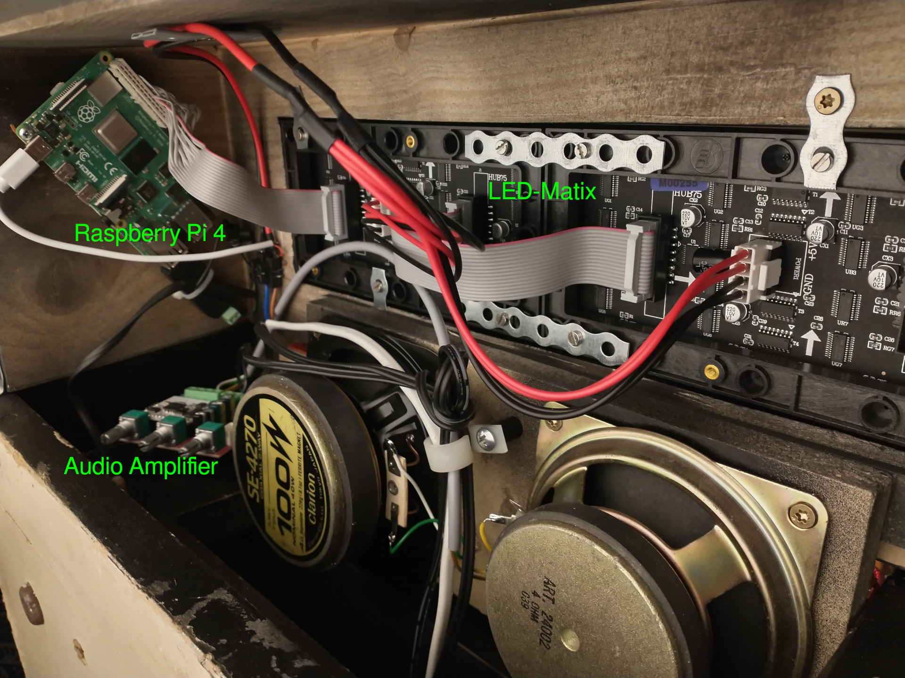
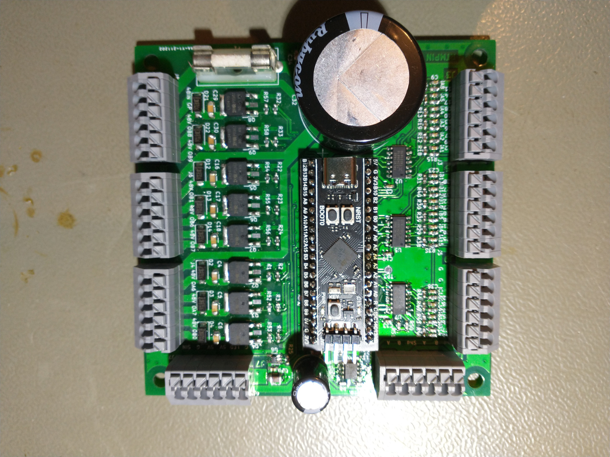
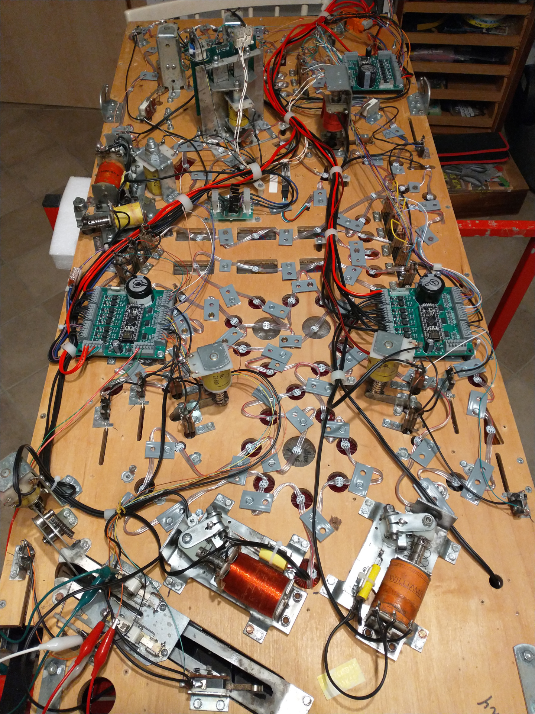
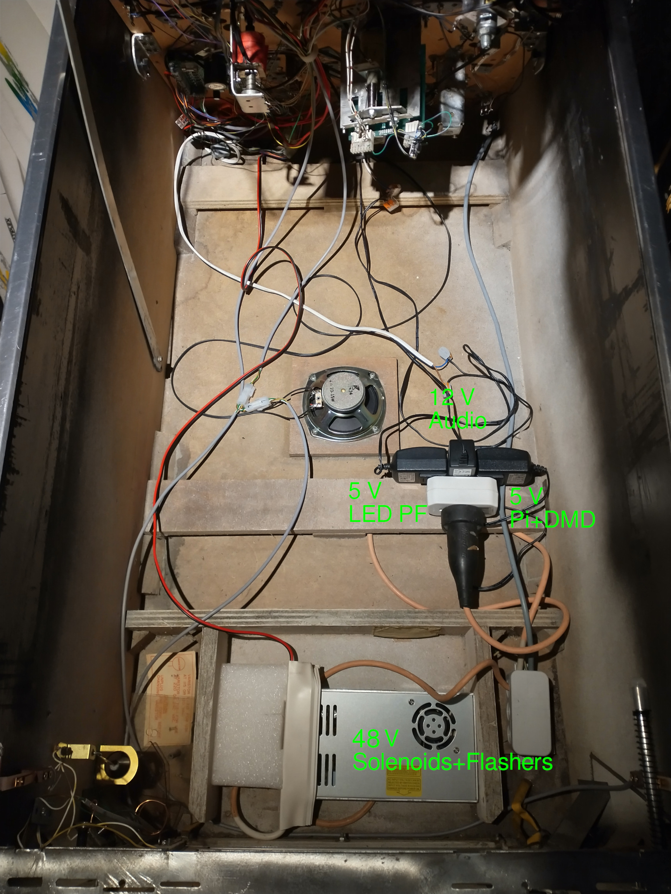

# Technical Description RTMpin

## Overview
The emulator PinMAME runs on a Raspberry Pi and controls sound, DMD and a few IO-boards underneath the playfield. These in turn read the switch positions and activates the coils and lamps.

## Electronics
The heart is a Raspberry Pi 4, which is connected to:
* LED-Matrix (DMD) via the digital I/O pins of the Raspi. 
* Audio amplifier via Bluetooth
* IO boards (nodes, underneath the board) via serial bus connection RS485

The LED matrix is a purchased part, as is the audio amplifier (Class D, 2 x 15 W for speakers in the backbox plus 30 W for the subwoofer in the cabinet). The IO-boards (nodes) are selfmade.

### IO-boards (nodes)
Each of the IO-boards (IO stands for Input/Output) can switch 8 high current outputs, read 18 inputs (direct inputs, no matrix circuitry) and drive a LED strip with WS2812 RGB LEDs. This is used to do all the lights under the playfield and the GI. For the Rollergames 3 IO-boards were necessary (actually 4 would be necessary, but to save a node I did it without the 3 control buttons for the menu navigation. At the moment I make these settings on the computer and then copy the corresponding file to the Raspberry. Maybe I'll add the switches to the IO's of the Raspberry, if I miss them).

The control of the inputs and outputs and the communication with the Raspberry Pi is done by a STM32F401. I used a small board (Blackpill) for this, because it was better available than the microcontrollers themselvs (they were not at all available when I developed the board).

### Data communication
For communication with the Raspberry Pi I decided to use the serial bus connection RS485 (half duplex, 115 kbit/s). This is very robust (resistant to electro magnetic interference, EMI) and requires only two lines (plus a reference ground if necessary).

### Wiring
The wiring of the lamps is quite straightforward, since all LEDs have a small controller on board, which takes it's data packet from the serial data stream and passes the rest on to the next LED. Therefore only one wire for the data plus two wires for the power supply are needed.

For the wiring to the coils I used a 2-wire line per coil. This has significant advantages for electromagnetic compatibility (EMC), because the forward and return conductors are close to each other and thus emit less interference. Due to the distributed nodes on the bottom side of the board, the overall wiring is "mostly harmless".

### Power supply
The power supply for the components is made by 4 purchased power supplies:
* 5 V, 2.5 A for Raspi and DMD.
* 5 V, 2.5 A for node electronics and lamps
* 48 V, 7.3 A for the coils and flasher
* 12 V, 2 A for audio (I don't need the full power of the amplifier)

The two 5 V power supplies could be combined by a stronger single power supply, but I already had the wall power supplys at home, so they were used.

## Software
### PinMAME
The linchpin of the software is the pinball emulator PinMAME:  
[https://github.com/vpinball/pinmame](https://github.com/vpinball/pinmame)  
The development team did a great job here and even ported the software to Linux, which makes it possible to control the pinball via a Raspberry Pi in the first place.

The pinball emulator runs on the Raspberry Pi 4 under a headless Linux (Raspberry Pi OS Lite). I had to make some adjustments to PinMAME for controlling the DMD and communicating with my IO boards (which lamps and coils are currently active and also for reading back the current switch states). 

### RPI RGB LED matrix
To control the DMD I used the excellent and well documented library from H. Zeller:  
[https://github.com/hzeller/rpi-rgb-led-matrix](https://github.com/hzeller/rpi-rgb-led-matrix)

### Firmware for IO boards
The software for the nodes was created with the development environment from ST Microelectronics for the STM32 family in C programming language. This went quite well, but as it was only a "prove of concept", I hardcoded many parameters and structured the code as simple as possible. I paid special attention to short interrupt routines and continuous (without waiting times) loop-based instruction sequences (similar to PLC programming). This is the only way to achieve the fast data sequences (almost 1 MHz) for the LED strips, which must be done in parallel to the RS485 transmission (115 kBaud) and in parallel to the IO control.

About all 60 ms the IOs (inputs and outputs) are updated by PinMAME. This is too slow for some functions. Therefore e.g. the flippers, bumpers and sling shots are controlled directly by the nodes. Here the delay time is shorter than one millisecond and therefore negligible.

All coils and flashers are powered with 48 V, so I only need one power supply for the power outputs. However, not all coils (and certainly not the flashers) are designed for 48 V, so all outputs are pulse width modulated (PWM). Therefore the time-averaged (and thus relevant) supply voltage for each coil and flasher can be adjusted individually.

The software for the IO boards can be updated directly from the Raspberry Pi. To do this, you can log in remotely (via ssh) to the Raspberry Pi and then start the software update. Very convenient - in my opinion - since you don't even have to open the pinball machine. The only data connection from the Raspi to the nodes is the RS485 bus. So the software update has to run over it, too. The process and the data transfer on the Raspberry side was realized via Python scripts.
