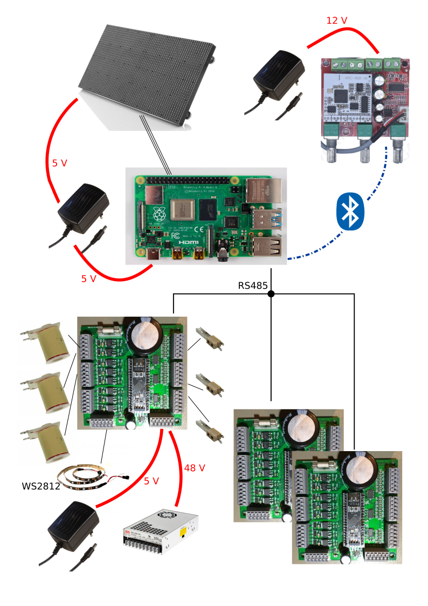

# RTMpin
This is a pinball project.

A Rollergames playfild was turned into a hybrid pinball machine (pinball firmware via pinmame like in virtual pinball, but with real playfield and steel balls).

The emulator Pinmame runs on a Raspberry Pi and controls sound, DMD and a few IO-boards underneath the playfield. These in turn read the switch positions and activates the coils and lamps.

