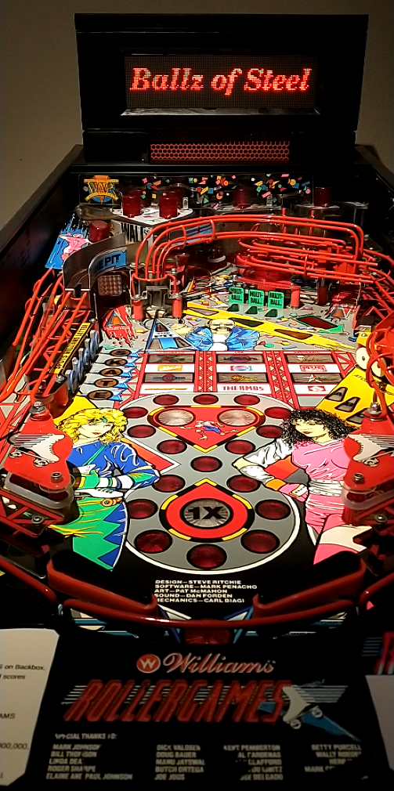

# RTMpin
This is a pinball project.

A Rollergames playfild was turned into a hybrid pinball machine (pinball firmware via PinMAME like in virtual pinball, but with real playfield and steel balls).

The emulator PinMAME runs on a Raspberry Pi and controls sound, DMD and a few IO-boards underneath the playfield. These in turn read the switch positions and activates the coils and lamps.

Watch a Video:

<video width="608" height="1280" controls>
  <source src="./Documentation/rg1stgame.mp4" type="video/mp4">
</video>
